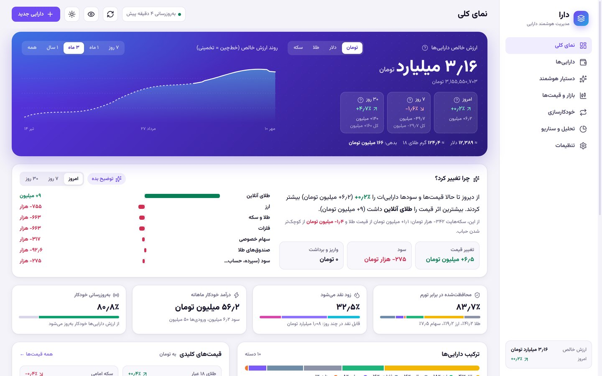
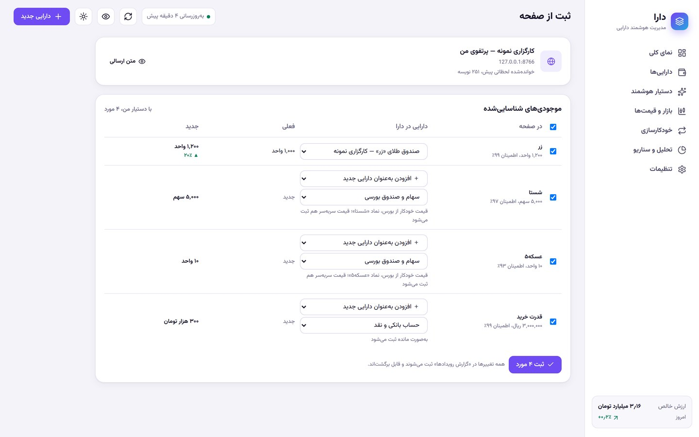

# دارا — مدیریت هوشمند دارایی

افزونه کروم برای دیدن همه دارایی‌ها در یک‌جا، با قیمت روز، تاریخ شمسی و رابط فارسی.
همه داده‌ها فقط روی مرورگر خودت ذخیره می‌شوند و هیچ سروری در کار نیست.

> اعداد تصویرها نمونه و ساختگی‌اند.

## چه کار می‌کند
- **همه‌چیز یک‌جا:** طلا، سکه، ارز، بورس، صندوق، رمزارز، سپرده، طلب و وام.
- **قیمت خودکار:** هر ۳۰ دقیقه از منابع عمومی بازار به‌روز می‌شود.
- **ارزش پولت چه شد؟** بازده واقعی در برابر دلار، طلا و سپرده بانکی.
- **چرا تغییر کرد؟** اثر بازار، سود سپرده‌ها و پولی که جابه‌جا کردی، جدا از هم.
- **حباب سکه و صندوق‌های طلا:** ارزش طلای داخل هر سکه از انس و دلار، با هشدار حباب.
- **ثبت از صفحه:** در سایت کارگزاری، صرافی یا پلتفرم طلا راست‌کلیک کن؛ موجودی‌ها خوانده می‌شوند و تو فقط تأیید می‌کنی.
- **دستیار هوش مصنوعی (اختیاری):** پرسش و پاسخ، ثبت با یک جمله، سناریو با یک جمله، نقد پرتفوی و گزارش هفتگی. با کلید API خودت از هر سرویس سازگار با OpenAI یا Anthropic. می‌توانی تعیین کنی فقط درصدها فرستاده شوند، نه مبلغ‌ها.
- **خودکارسازی:** سود روزشمار، حقوق، قسط وام و خرید ماهانه، سر موعد و قابل برگشت.
- **ورود و پشتیبان:** ورود از اکسل یا لینک گوگل‌شیت، خروجی CSV و پشتیبان کامل JSON.

## نصب
1. از بخش [Releases](../../releases/latest) فایل `dara-extension-vX.Y.Z.zip` آخرین نسخه را بگیر و در یک پوشه ثابت باز کن (این پوشه را بعداً جابه‌جا نکن).
2. در کروم به `chrome://extensions` برو و **Developer mode** را روشن کن.
3. **Load unpacked** را بزن و همان پوشه‌ای را انتخاب کن که `manifest.json` مستقیم داخلش است.
4. آیکون دارا را به نوار ابزار سنجاق کن. صفحه خوش‌آمد راهنمای قدم‌های اول است.

## به‌روزرسانی
فایل‌های نسخه جدید را روی همان پوشه قبلی بریز. مسیر نباید عوض شود تا داده‌ها حفظ شوند. نسخه جدید با تازه‌کردن صفحه دارا یا باز کردن پنجره کوچکش نصب می‌شود. فهرست تازه‌های هر نسخه در Releases و در تنظیمات خود افزونه هست.

## پیش از استفاده بدان
- دارا هنوز اول راه است و ممکن است ایراد یا باگ داشته باشد. قبل از تغییرات بزرگ، از تنظیمات ← داده‌ها پشتیبان کامل بگیر.
- قیمت‌ها از منابع عمومی خوانده می‌شوند و ممکن است با تأخیر یا خطا همراه باشند.
- عددها و تحلیل‌ها برای شناخت بهتر دارایی‌هاست، نه توصیه خرید و فروش.

## بازخورد
باگ دیدی یا فیچری به ذهنت رسید؟ در بخش [Issues](../../issues) بنویس. لطفاً در گزارش‌ها و اسکرین‌شات‌ها مبلغ و اطلاعات دارایی‌های واقعی‌ات را نگذار.

## برای توسعه
- کد افزونه در پوشه `extension` است (Manifest V3، بدون مرحله build).
- تست‌ها: `npm test`. داده نمونه برای تست‌های رابط کاربری: `node dev/qa/demo_seed.mjs` (فقط داده ساختگی).
- ریلیز خودکار است: وقتی `version` در `extension/manifest.json` بالا برود و روی `main` پوش شود، گیت‌هاب اکشن تست‌ها را اجرا می‌کند و ریلیز را با فایل zip و متن همان نسخه از `extension/lib/changelog.js` منتشر می‌کند.
